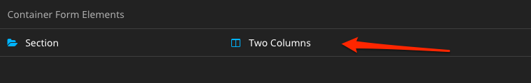

# Multi Column Form Element

This package adds a new Form Element `Wwwision.Form.MultiColumnSection:TwoColumns`
to the `default` preset that allows to render Multi-Column sections within Forms
of the [Flow Form Framework](https://github.com/neos/form).

It includes:

* Form Framework Element definition in `Settings.yaml`, including the corresponding custom PHP implementation
* The Fusion & Node Type definition required to make this work with the `neos/form-builder`
* A Fluid template that will be used when rendering the form with the default `FluidFormRenderer`
* A Fusion prototype that will be used when rendering the form with the `neos/form-fusionrenderer`

## Usage

Install this package using GIT:

```
git clone https://github.com/bwaidelich/Wwwision.Form.MultiColumnSection.git Packages/Application/Wwwision.Form.MultiColumnSection
```

And make sure to rescan the installed packages so that it is properly installed:

```
./flow flow:package:rescan
```

**Note:** This package requires the `neos/form` package in version 4.0 or higher

### Usage in the Neos Form Builder

In the Neos backend there's now a new Content Element type that can be
added to node-based Forms:



When inserted, child elements can be added to the `column1Elements` or
`column2Elements` FormElementCollections.

### Usage from Fusion

This Form Element can also be used from Fusion like this

```fusion
prototype(Some.Package:SomeForm) < prototype(Neos.Form.Builder:Form) {
    presetName = 'somePreset'
    firstPage {
        elements {
            twoCols = Wwwision.Form.MultiColumnSection:TwoColumns.Definition {
                label = 'Name and Email'
                column1Elements {
                    name = Neos.Form.Builder:SingleLineText.Definition {
                        label = 'Name'
                    }
                }
                column2Elements {
                    email = Neos.Form.Builder:SingleLineText.Definition {
                        label = 'Email'
                        validators {
                            emailAddress = Neos.Form.Builder:EmailAddressValidator.Definition
                        }
                    }
                }
            }
        }
    }
}
```

### Usage in YAML Form definitions

The structure of the YAML Form definition is strict, so it's not allowed
to use custom keys like `column1Elements`.
Instead the column assignment is done via a custom `renderingOption` "_column":

```yaml
type: 'Neos.Form:Form'
identifier: some-identifier
renderables:
    -
        type: 'Neos.Form:Page'
        identifier: page1
        renderables:
            -
                type: 'Wwwision.Form.MultiColumnSection:TwoColumns'
                identifier: two-columns
                label: 'Two Columns'
                renderables:
                    -
                        type: 'Neos.Form:SingleLineText'
                        identifier: name
                        renderingOptions:
                          _column: 1
                        label: "Name"
                    -
                        type: 'Neos.Form:SingleLineText'
                        identifier: email
                        renderingOptions:
                          _column: 2
                        label: "Email"
                        validators:
                            -
                                identifier: 'Neos.Flow:EmailAddress'
```